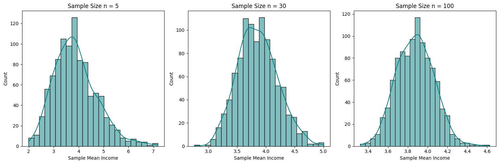

# Data Science Statistics Portfolio

**Author**: Paul Tuccinardi

**Goal**: Aspiring Data Scientist

This repository contains a collection of projects demonstrating foundational statistical concepts applied to real-world data using both Python and R. The goal of this portfolio is to showcase proficiency in statistical modeling, hypothesis testing, and data visualization across the two primary languages used in Data Science.

## 📊 Dataset: California Housing
All projects in this repository utilize the California Housing Dataset.

- Target Variable: median_house_value (MEDV)

- Primary Predictor: median_income (Income)

- Categorical Feature: ocean_proximity (Location)

## 📁 Projects

### 01. Linear Regression
- **Goal**: Predict median house values based on median income.
- **Concepts**: Correlation, Ordinary Least Squares (OLS), Coefficients, R-squared.
- **Key Insight**: In both Python and R implementations, we found that median income is a strong, statistically significant predictor of house value, explaining approximately 47% of the variance ($R^2 \approx 0.47$).
- **Files**: [01_Linear_Regression.ipynb](./01_Linear_Regression/01_Linear_Regression.ipynb), [01_Linear_Regression.Rmd](./01_Linear_Regression/01_Linear_Regression.Rmd), [01_Linear_Regression.html](./01_Linear_Regression/01_Linear_Regression.html)

### 02. Hypothesis Testing (T-Tests)

- **Goal**: Determine if proximity to the ocean significantly impacts house values.
- **Concepts**: Null vs. Alternative Hypotheses, P-values, Independent Samples T-test.
- **Key Insight**: Using an Independent Samples T-test, we rejected the null hypothesis ($p < 0.05$). We confirmed a statistically significant difference in prices between houses located "NEAR BAY" vs. "INLAND."
- **Files**: [02_Hypothesis_Testing.ipynb](./02_Hypothesis_Testing/02_Hypothesis_Testing.ipynb), [02_Hypothesis_Testing.Rmd](./02_Hypothesis_Testing/02_Hypothesis_Testing.Rmd), [02_Hypothesis_Testing.html](./02_Hypothesis_Testing/02_Hypothesis_Testing.html)

## 03. Central Limit Theorem
- **Goal**: Demonstrate how the distribution of sample means approaches a normal distribution as the sample size increases, regardless of the shape of the original population data.
- **Concepts**:Sampling Distributions, Law of Large Numbers, Normal Distribution, Standard Error, and Sample Size (n).
- **Key Insights**:
    - Using the skewed median_income data, we observed that smaller sample sizes (n=5) retain much of the original data's skewness. 
    - As the sample size reaches n=30 and n=100, the distribution of means forms a symmetric "Bell Curve," as predicted by the CLT.
    - This project justifies the use of parametric tests (like the T-tests used in Project 02) even when working with non-normally distributed real-world data.
- **Files**: [03_Central_Limit_Theorem.ipynb](./03_Central_Limit_Theorem/03_Central_Limit_Theorem.ipynb), [03_Central_Limit_Theorem.Rmd](./03_Central_Limit_Theorem/03_Central_Limit_Theorem.Rmd), [03_Central_Limit_Theorem.html](./03_Central_Limit_Theorem/03_Central_Limit_Theorem.html)

## 🛠️ Tools & Technologies
- **Languages**: Python, R
- **Python Libraries**: pandas, numpy, matplotlib, seaborn, scipy, statsmodels
- **R Libraries** : tidyverse (dplyr, ggplot2, readr), rmarkdown

## 🏢 Business Impact & Real-World Application
While these projects utilize a standard housing dataset, the statistical methods applied are fundamental to high-stakes decision-making in industry:

1. Strategic Forecasting (Linear Regression)
  - Business Context: Used for Demand Planning and Price Optimization.

  - Application: By quantifying how income drives property value, we move from guessing to predicting. In a retail or tech environment, this same OLS framework allows a company to forecast quarterly revenue based on marketing spend or user growth, ensuring efficient resource allocation.

2. Risk Mitigation & Evidence-Based Testing (Hypothesis Testing)
  - Business Context: The backbone of A/B Testing and Product Validation.

  - Application: Our T-test proved that location isn't just a variable—it's a statistically significant driver of cost. For a business, this methodology is used to validate if a new website UI, a different pricing tier, or a marketing campaign actually improves conversion rates before committing millions in capital.

3. Reliability & Scalable Analytics (Central Limit Theorem)
  - Business Context: Essential for Quality Control and Anomaly Detection.

  - Application: The CLT provides the mathematical confidence needed to trust our metrics. Whether a bank is analyzing a sample of 1,000 credit applications or a streaming service is looking at millions of user sessions, the CLT allows us to calculate margins of error and "Confidence Intervals," ensuring that leadership is making decisions based on reliable data patterns rather than noise.